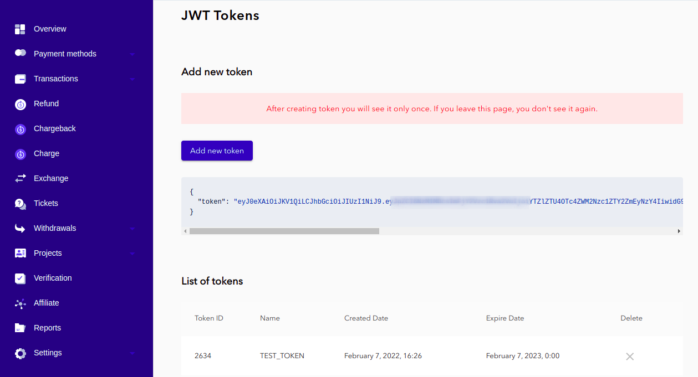

* [Back to contents](../Readme.md#contents)

# Bearer Authentication

Some requests to PayOp API require authentication.

PayOp API Authentication is based on JWT tokens and uses [Bearer Authentication](https://swagger.io/docs/specification/authentication/bearer-authentication/).
The client must send this token in the `Authorization` header when making requests to protected resources.


```shell
Content-Type: application/json
Authorization: Bearer YOUR_JWT_TOKEN
``` 


---

**Note:** *Authentication using a `token` header is **deprecated**.
This functionality may be removed in the next major API version.*

---

## Get authentication token

You can **create** and **view** your API keys in [your account](https://payop.com/en/profile/settings/jwt-token).




---

**Note:** *After creating a token, you will see it only once, right after creation. 
However, you can create as many tokens as you need.*

---

After you **delete** your token, you can't authenticate with this token anymore.

You can set a token **expiration date**. After this date, you can't authenticate with this token anymore. 
If the expiration date is not set, the token can be used until it is deleted.