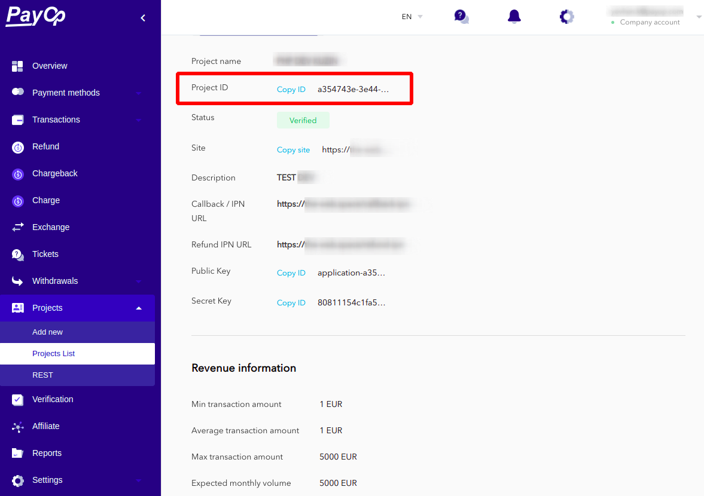

* [Back to contents](../Readme.md#contents)

# Merchant payment methods

* [Endpoint description](#endpoint-description)
* [Request example](#request-example)
* [Successful response example](#successful-response-example)
* [Required fields description](#required-fields-description)

## Endpoint description

**Important!** This endpoint requires [authentication](../Authentication/bearerAuthentication.md).

Get payment methods list available for merchant per application/project.

You should be noted that when creating an invoice you can only use payment methods available for your application.

**Endpoint:**


```shell
https://payop.com/v1/instrument-settings/payment-methods/available-for-application/{ID}
```

<br>

> Note: You can find out the project ID in the merchant's admin panel in the Projects -> Project List -> Details section
> 
> 


    Content-Type: application/json
    Authorization: Bearer eyJ0eXAiOiJKV...

**Parameters:**

Parameter   |  Type  |           Description           |  Required |
------------|--------|---------------------------------|-----------|
ID          | string | Application/Project identifier  |     *     |

## Request example

```shell script
curl -X GET \
  https://payop.com/v1/instrument-settings/payment-methods/available-for-application/YOUR_PROJECT_ID \
    -H 'Content-Type: application/json' \
    -H 'Authorization: Bearer eyJ0eXAiOiJKV...'
```

## Successful response example


```shell
HTTP/1.1 200 OK
Content-Type: application/json
token: eyJ0eXAiOiJKV...
```


```json
{
    "data":[
        {
            "identifier":336,
            "type":"cards_local",
            "formType":"standard",
            "title":"Argencard",
            "logo":"https://payop.com/assets/images/payment_methods/argencard.jpg",
            "parentIdentifier":null,
            "pmIdentifier":"a728eb60-f8ac-11e8-afc4-65c7f5e909d5",
            "currencies":[
                "USD"
            ],
            "countries":[
                "AR"
            ],
            "config":{
                "fields":[
                    {
                        "name":"email",
                        "type":"email",
                        "required":true
                    },
                    {
                        "name":"name",
                        "type":"text",
                        "required":true
                    },
                    {
                        "name":"nationalid",
                        "type":"text",
                        "title":"Consumer`s national id",
                        "required":true
                    }
                ]
            }
        }
    ],
    "status":1
}
```

## Required fields description

As you can see, the `config.fields` section of the response contains a description of required the fields.
For direct payments (payments without an intermediate checkout form) that rely on this payment method, you must fill out all the required fields when [create an invoice](createInvoice.md).
Otherwise, during the payment process, the payer will be redirected to the checkout form, where they will have to manually fill in the required fields.

> Note: Please note the way in which the fields are filled in: fields `email`, `phone`, `name` are contained in the `payer` object, and all other necessary fields are contained in a nested `extraFields` object.
 Example: 
 
 ```json
 {
     "payer": {
         "email": "user+1@payop.com",
         "phone": "",
         "name": "",
         "extraFields": {
           "nationalid": "GB-123456798",
           "other": "some data"
         }
     }
 }
 ```